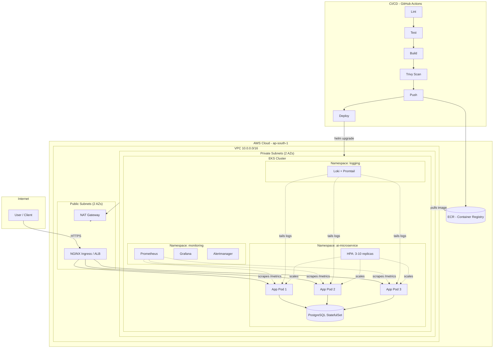
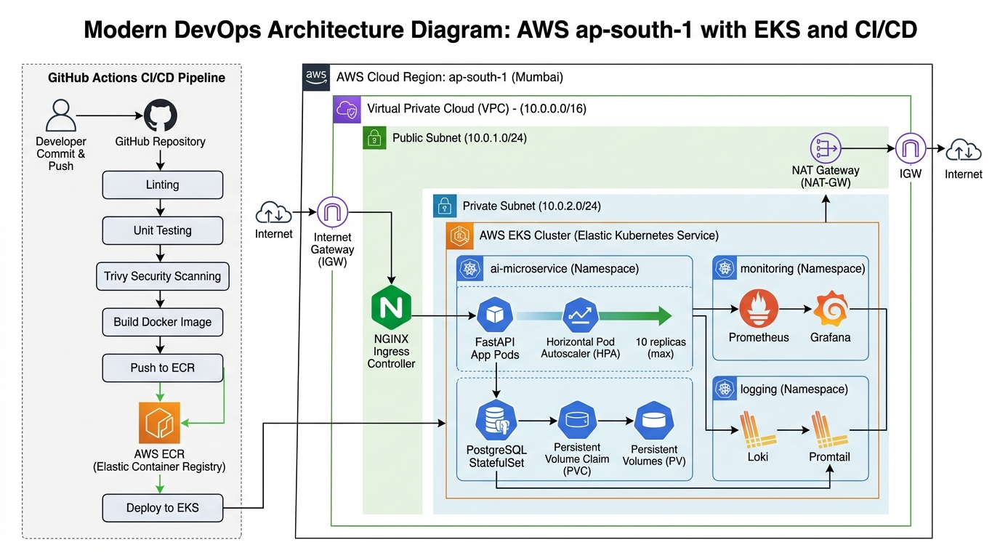

# Architecture

## Request flow
1. Client hits the Ingress (NGINX) over HTTPS, TLS terminated via cert-manager + Let's Encrypt.
2. Ingress routes to the `ai-microservice-svc` ClusterIP Service, load-balanced across pods.
3. Pods (non-root, resource-limited) serve FastAPI, read/write PostgreSQL via a StatefulSet with persistent volume.
4. HPA watches CPU/memory and scales pods 3→10 under load.
5. Prometheus scrapes `/metrics` on every pod every 15s; Grafana visualizes; Alertmanager fires on error-rate/restart-loop rules.
6. Promtail ships structured JSON logs to Loki, queried from the same Grafana.

## Deployment flow (CI/CD)
Push to `main` → lint → test (with ephemeral Postgres) → build Docker image →
Trivy scan (fails build on CRITICAL/HIGH CVEs) → push to ECR → `helm upgrade`
against EKS via GitHub OIDC (no static AWS keys in CI).

## Graphical Architecture Diagram

Below is the visual block diagram representing the full VPC, EKS, and CI/CD pipelines:

