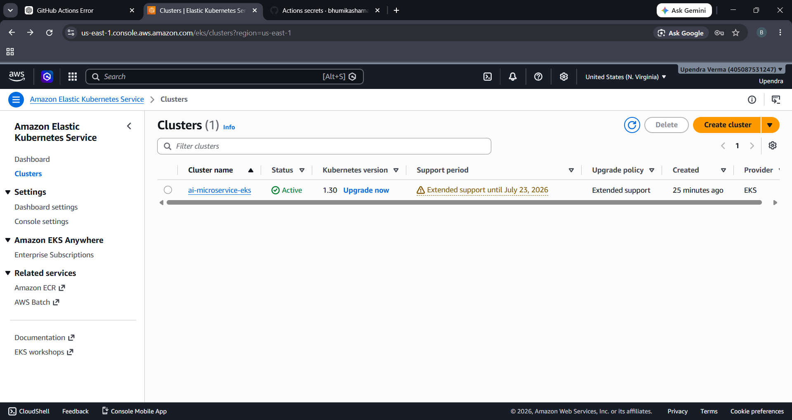
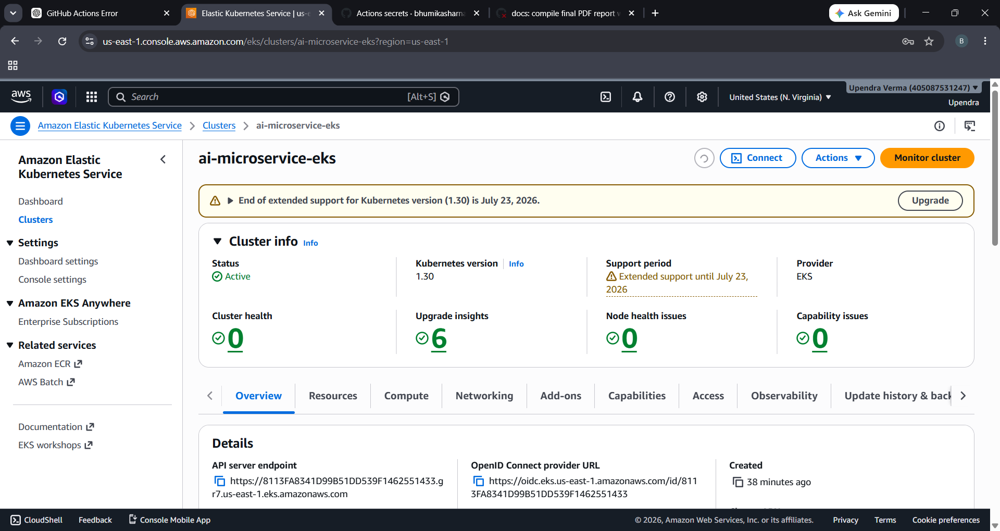
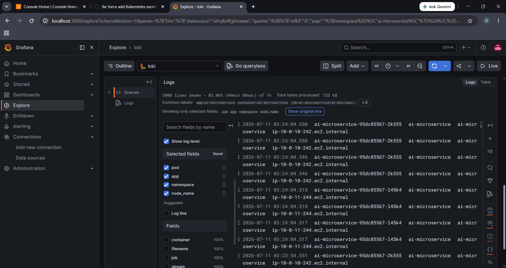

# AI Microservice — Production-Ready Deployment Pipeline

A production-ready FastAPI application integrated with a PostgreSQL database, containerized, secured, and deployed to a multi-node AWS EKS cluster. This repository implements a fully automated CI/CD pipeline, centralized logging and monitoring, strict security hardening policies, and infrastructure-as-code (IaC).

**Full Architecture Diagram:** [`docs/architecture.md`](docs/architecture.md)  
**Security Hardening Deep-Dive:** [`docs/security-notes.md`](docs/security-notes.md)  

---

## 📂 Project Repository Structure

```text
app/                   # FastAPI application source code and unit tests
docker/                # Multi-stage Dockerfile and docker-compose.yml for local testing
k8s/                   # Raw Kubernetes manifests (00-namespace.yaml to 10-poddisruptionbudget.yaml)
terraform/             # IaC configurations (VPC, Subnets, EKS, Node Groups, IAM)
.github/workflows/     # CI/CD pipeline (GitHub Actions)
monitoring/            # Prometheus/Grafana alert rules and ServiceMonitors
logging/               # Loki and Promtail logging values
docs/                  # Architecture diagrams, security audits, and verification screenshots
```

---

## 🛠️ Step-by-Step Deployment & Configuration Guide

Follow these sequential phases to reproduce the entire microservice stack, from local containerization to live cloud monitoring.

---

### 🔹 Phase 1: Local Setup & Containerization (Docker)

Validate the application and database connectivity locally before deploying to the cloud.

1. **Build and start the application stack locally:**
   ```bash
   cd C:\Users\hp\Downloads\Assignment-corrected
   docker compose -f docker/docker-compose.yml up --build -d
   ```
2. **Verify application health and database queries:**
   - Healthcheck: `curl http://localhost:8000/health`
   - Make a prediction request:
     ```bash
     curl -X POST http://localhost:8000/predict -H "Content-Type: application/json" -d '{"input_text":"DevOps demo"}'
     ```
   - Interactive Swagger API docs: `http://localhost:8000/docs`
   - Postgres Database Viewer (Adminer): `http://localhost:8080` (Use credentials in `docker-compose.yml`)

#### **Local Setup Verification Proofs:**
* **Docker Compose Startup Logs:**
  
* **PostgreSQL Database Storage (Adminer View):**
  

---

### 🔹 Phase 2: AWS Infrastructure Provisioning (Terraform)

Provision the production-ready AWS network and EKS cluster using Terraform.

1. **Initialize Terraform providers and modules:**
   ```bash
   cd terraform
   terraform init
   ```
2. **Preview provisioning plan:**
   ```bash
   terraform plan -out=tfplan
   ```
3. **Deploy the infrastructure to AWS:**
   ```bash
   terraform apply tfplan
   ```
   *(This step takes about 10-12 minutes to create the VPC, NAT Gateway, EKS Cluster, and EC2 Node Groups).*

#### **AWS EKS Provisioning Verification Proofs:**
* **EKS Cluster Active Status (AWS Console):**
  
* **EKS Cluster Specifications & API Endpoint:**
  

---

### 🔹 Phase 3: Connect Local Environment to EKS

Link your local terminal's `kubectl` context to the newly created EKS cluster.

1. **Configure kubectl with EKS cluster credentials:**
   ```bash
   aws eks update-kubeconfig --region us-east-1 --name ai-microservice-eks
   ```
2. **Verify node connection:**
   ```bash
   kubectl get nodes
   ```
   *(You should see 2 EC2 nodes in `Ready` status).*

---

### 🔹 Phase 4: Manual Step-by-Step Kubernetes Deployment

To understand the exact resource dependency order, apply the raw manifests sequentially:

1. **Create the Namespace:**
   ```bash
   kubectl apply -f k8s/base/00-namespace.yaml
   ```
2. **Apply ConfigMaps and Secrets:**
   ```bash
   kubectl apply -f k8s/base/01-configmap.yaml
   kubectl apply -f k8s/base/02-secret.yaml
   ```
3. **Deploy the Database Layer:**
   ```bash
   kubectl apply -f k8s/base/03-postgres.yaml
   ```
   *Wait for the database statefulset to be fully ready:*
   ```bash
   kubectl rollout status statefulset/postgres -n ai-microservice
   ```
4. **Deploy RBAC Authorization Policies:**
   ```bash
   kubectl apply -f k8s/base/04-serviceaccount-rbac.yaml
   ```
5. **Deploy the Application Pods:**
   ```bash
   kubectl apply -f k8s/base/05-deployment.yaml
   ```
   *Wait for the FastAPI pods rollout to complete:*
   ```bash
   kubectl rollout status deployment/ai-microservice -n ai-microservice
   ```
6. **Apply LoadBalancer Services & Routing Ingress:**
   ```bash
   kubectl apply -f k8s/base/06-service.yaml
   kubectl apply -f k8s/base/07-ingress.yaml
   ```
7. **Deploy Scaling Limits and Security Policies:**
   ```bash
   kubectl apply -f k8s/base/08-hpa.yaml
   kubectl apply -f k8s/base/09-networkpolicy.yaml
   kubectl apply -f k8s/base/10-poddisruptionbudget.yaml
   ```

#### **Kubernetes Verification Proofs:**
* **Kubernetes Pods & Services Running Status:**
  

---

### 🔹 Phase 5: GitHub Actions CI/CD Pipeline Setup

Automate container compilation, vulnerability scans, ECR push, and EKS deployments.

1. **Base64 encode your local `kubeconfig`:**
   ```powershell
   [Convert]::ToBase64String([System.IO.File]::ReadAllBytes("$HOME/.kube/config"))
   ```
2. **Configure GitHub Repository Secrets:**
   Add these keys under `Settings -> Secrets and variables -> Actions`:
   - `AWS_ACCESS_KEY_ID`: Your AWS Access Key.
   - `AWS_SECRET_ACCESS_KEY`: Your AWS Secret Access Key.
   - `KUBE_CONFIG`: The Base64 encoded string generated in the step above.
3. **Trigger Pipeline:**
   Push a commit to the `main` branch to trigger CI/CD:
   ```bash
   git add --all
   git commit -m "deploy: test automated CD rollout"
   git push origin main
   ```

#### **CI/CD Automation Proofs:**
* **GitHub Actions Succeeded CI/CD Workflow Pipeline:**
  
* **Trivy Container Vulnerability Scan Logs:**
  

---

### 🔹 Phase 6: Observability (Prometheus, Grafana, Loki)

Configure metrics and logs aggregation directly on the EKS cluster.

1. **Install Prometheus & Grafana Monitoring Stack:**
   ```bash
   helm repo add prometheus-community https://prometheus-community.github.io/helm-charts
   helm repo update
   helm install monitoring prometheus-community/kube-prometheus-stack -n monitoring --create-namespace --set prometheus.prometheusSpec.podMonitorSelectorNilUsesHelmValues=false --set prometheus.prometheusSpec.serviceMonitorSelectorNilUsesHelmValues=false
   ```
2. **Install Loki & Promtail Logging Stack:**
   ```bash
   helm repo add grafana https://grafana.github.io/helm-charts
   helm repo update
   helm install loki grafana/loki-stack -n logging --create-namespace --set promtail.enabled=true --set loki.persistence.enabled=false
   ```
3. **Access the Grafana Dashboard:**
   - Get the admin password:
     ```powershell
     [System.Text.Encoding]::UTF8.GetString([System.Convert]::FromBase64String((kubectl get secret --namespace monitoring monitoring-grafana -o jsonpath="{.data.admin-password}")))
     ```
   - Open a port-forward tunnel:
     ```bash
     kubectl port-forward -n monitoring svc/monitoring-grafana 3000:80
     ```
   - Open `http://localhost:3000` in your browser. (Login: `admin` / Password retrieved above).
   - Go to **Connections -> Data sources -> Add data source -> Loki** and enter:
     `http://172.20.120.127:3100` (Use Loki Service Cluster IP). Click **Save & test**.
   - Go to **Dashboards -> Import**, enter ID **`15661`**, select the Prometheus datasource, and click **Import**.

#### **Observability Verification Proofs:**
* **Live Grafana EKS Metrics Dashboard:**
  
* **Centralized Loki Logs Stream:**
  

---

### 🔹 Phase 7: Infrastructure Teardown (Cleanup)

To avoid active cloud bills, terminate the EKS cluster when finished:

```bash
cd terraform
terraform destroy -auto-approve
```
