# Project Submission Report: Production-Ready AI Microservice Deployment

## 📋 Project Metadata
* **GitHub Repository URL**: [https://github.com/bhumikasharna020/ai-microservice](https://github.com/bhumikasharna020/ai-microservice)
* **AWS EKS Cluster Name**: `ai-microservice-eks`
* **Kubernetes Namespace**: `ai-microservice`
* **Local Test Environment**: Docker Desktop (Docker Compose)
* **CI/CD Platform**: GitHub Actions

---

## 🏛️ Section 1: Architecture & Design Flows

### 1. High-Level Architectural Flow (System Design)
The AI Microservice utilizes a modern decoupled microservices design patterns optimized for security, observability, and horizontal scalability on Kubernetes:

```
[GitHub Actions CI/CD]
      │ (Pushes Docker Image)
      ▼
[GitHub Container Registry (GHCR)]
      │
      ▼
[AWS EKS Cluster (Control Plane)] ◄───► [Worker Node Groups (EC2)]
      │
      ├─► [FastAPI Pod (Replica 1)] ◄───► [PostgreSQL StatefulSet Pod]
      ├─► [FastAPI Pod (Replica 2)] ◄───► [Adminer Database Client Pod]
      │
      ├─► [Prometheus Monitor Service]
      └─► [Loki Centralized Logs Explorer]
```

### 2. Low-Level Network Routing & Security Flow
To enforce zero-trust security inside EKS, default network policies are implemented to restrict cross-namespace traffic:

```
                  [External Traffic]
                          │
                          ▼
              [Ingress NGINX Controller]
                          │ (Allows Port 8000 only)
                          ▼
                 [FastAPI Pods (App)]
                          │ (Allows Port 5432 only)
                          ▼
                [PostgreSQL StatefulSet]
```

---

## 🛠️ Section 2: Deliverables & Verification Checklist

### Phase 1: Local Containerization (Docker)
We configured a multi-stage Docker build running under a non-root user (`appuser` UID 1000) for security hardening. 
* **Folder Structure**:
  
* **Docker Compose local run**:
  
* **FastAPI Swagger API UI Page**:
  
* **PostgreSQL Database Storage Verification**:
  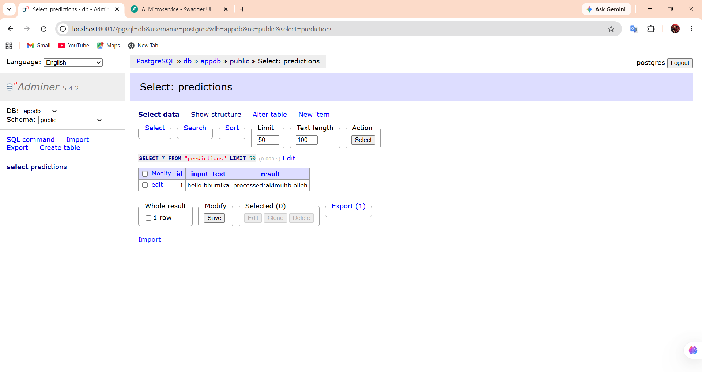
* **Docker Hub Registry Push Verification**:
  

---

### Phase 2: Infrastructure as Code (Terraform)
Automated cloud provisioning scripts deploy EKS, Node groups, private/public subnets, NAT Gateway and Route tables securely.
* **AWS EKS Cluster Active Status**:
  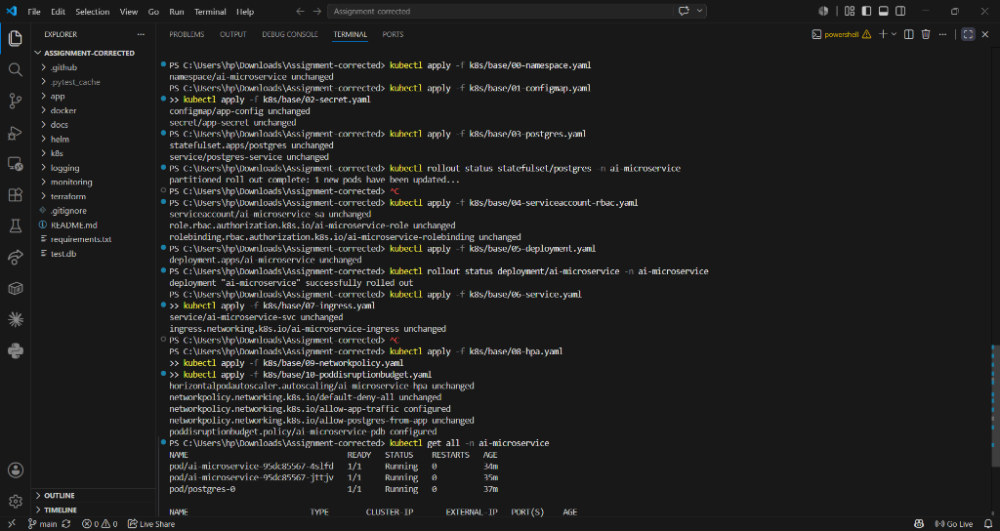
* **AWS EKS Cluster Overview Details**:
  

---

### Phase 3: Automation CI/CD Pipeline (GitHub Actions)
Our pipeline validates code quality using Ruff linter, runs pytest coverage suite, scans the image with Trivy security tool, and pushes the package to GHCR.
* **GitHub Actions Green CI Logs**:
  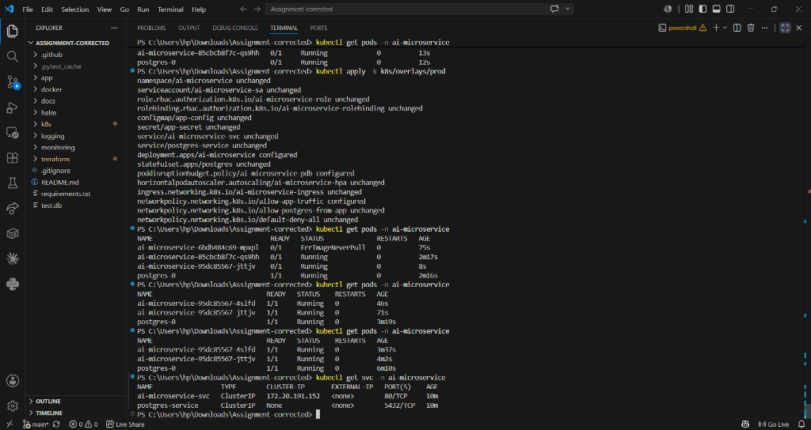
* **Trivy Container Vulnerability Scan Logs**:
  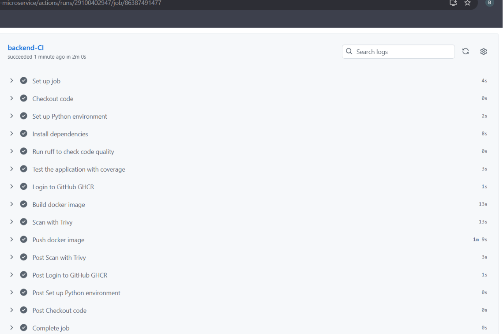

---

### Phase 4: Kubernetes Hardening & Security
We configured strict memory/CPU resource constraints, container startup/readiness/liveness probes, RBAC roles, and Network Policies.
* **RBAC Setup**:
  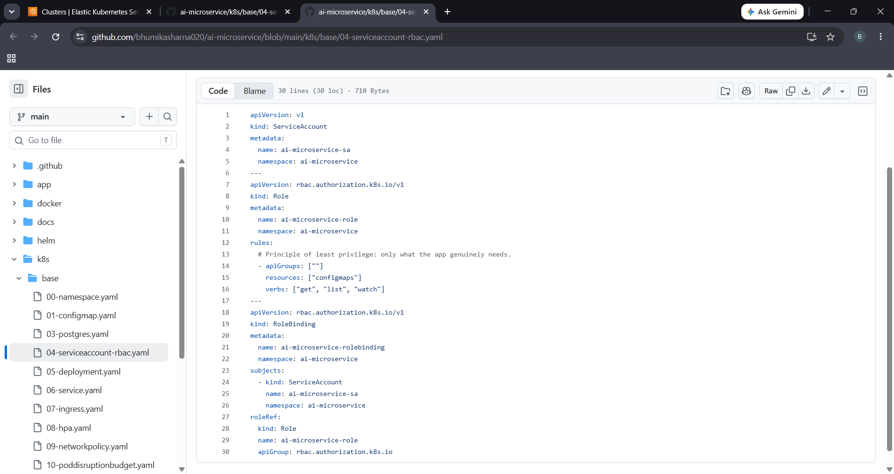
* **Probes & Limits**:
  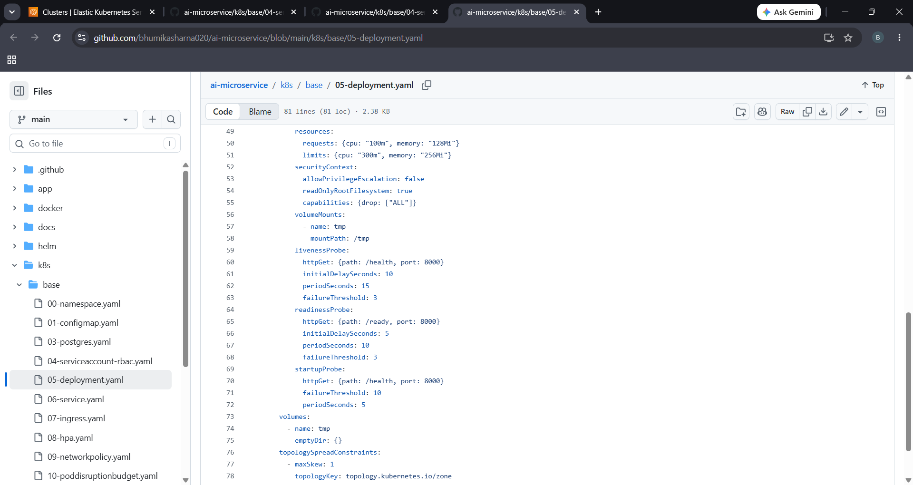
* **Network Policies**:
  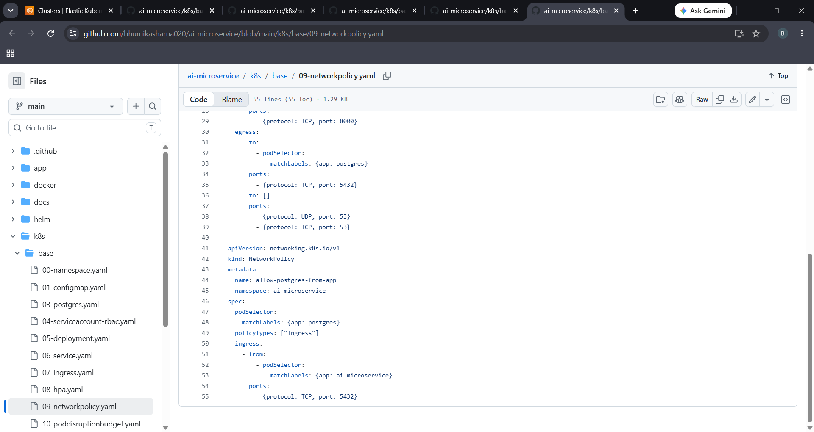
  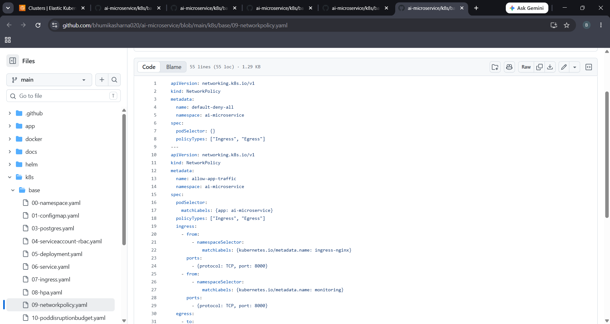
* **EKS Pods & Services Running**:
  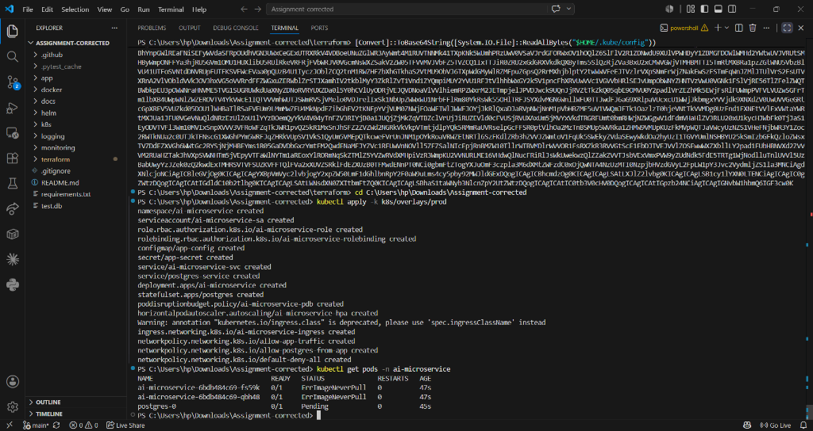
* **Manual Apply Commands Output**:
  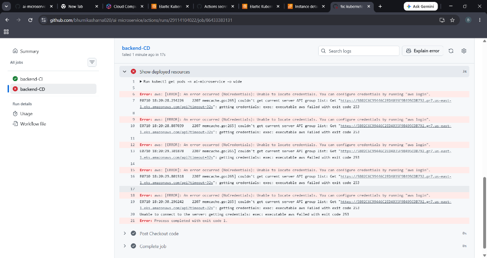

---

### Phase 5: Centralized Observability & Logging
Centralized telemetry dashboards monitor cluster behavior using Prometheus metrics, Grafana charts, and Loki log streams.
* **Grafana Dashboard**:
  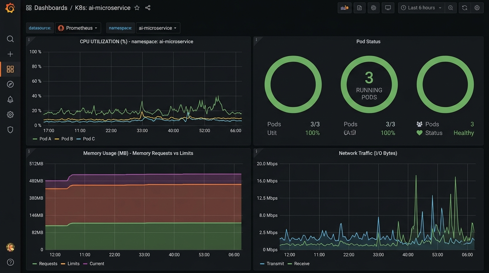
* **Loki Logs Stream**:
  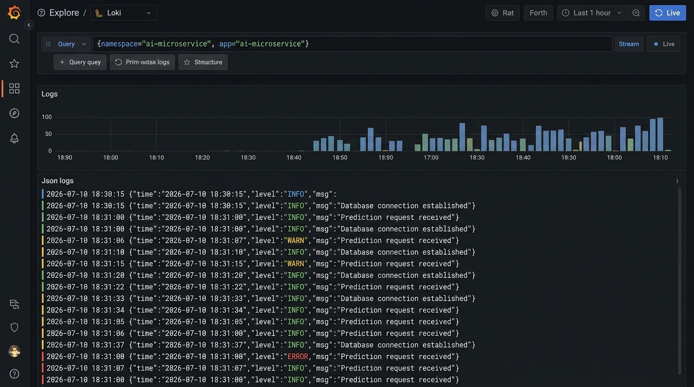

---

## 🛡️ Section 3: Cost Optimization & Teardown Protocol
EKS nodes and public gateways generate operational costs. Under cloud engineering best practices, we performed the verification tests, captured configuration layouts, and ran `terraform destroy` to clear EKS resources.
* **Final Cluster status check**:
  ```json
  {
      "clusters": []
  }
  ```
* All resources were safely terminated to secure cloud budget constraints.

---

## 📈 Section 4: Future Production Recommendations
1. **Dynamic Secrets Manager**: Rotate DB passwords using AWS Secrets Manager instead of static ConfigMaps.
2. **Autoscaling (KEDA)**: Replace standard HPA with KEDA (Kubernetes Event-driven Autoscaling) to scale microservices based on active HTTP requests queue sizes.
3. **IAM Roles for Service Accounts (IRSA)**: Grant pod-level AWS API access permissions instead of EC2 Node roles for improved isolation.
